# DevSecOps Portfolio – TP Automatisation (Ubuntu Server, Docker, Jenkins, Vagrant)

**Auteure :** Soulayma Hableni
**Dépôt GitHub :** https://github.com/soulaymahableni/mini-cv

**Environnement :** machine physique Windows, VMware Workstation, VM Ubuntu Server 26.04.1 LTS (`automatisation`, IP `192.168.190.141`).

---

## 1. Installation d'Ubuntu Server 26.04 et accès SSH sécurisé

Installation d'Ubuntu Server 26.04 dans VMware (réseau accessible depuis la machine physique), avec le paquet OpenSSH activé.

```bash
sudo apt update && sudo apt install -y openssh-server
sudo systemctl enable --now ssh
ip -4 a                      # relever l'adresse IP de la VM
sudo ufw allow OpenSSH
sudo ufw enable
```

**Sécurisation (authentification par clé) – depuis la machine physique (PowerShell) :**

```powershell
ssh-keygen -t ed25519 -C "tp-devsecops"
type $env:USERPROFILE\.ssh\id_ed25519.pub | ssh automatisation@192.168.190.141 "mkdir -p ~/.ssh && cat >> ~/.ssh/authorized_keys && chmod 700 ~/.ssh && chmod 600 ~/.ssh/authorized_keys"
```

**Durcissement dans la VM :**

```bash
sudo nano /etc/ssh/sshd_config.d/99-hardening.conf
```
```
PermitRootLogin no
PasswordAuthentication no
PubkeyAuthentication yes
MaxAuthTries 3
```
```bash
sudo sshd -t && sudo systemctl restart ssh
```

> Ne désactiver `PasswordAuthentication` qu'après avoir vérifié que la connexion par clé fonctionne.

## 2. Test de l'accès SSH depuis la machine physique

```powershell
ssh automatisation@192.168.190.141
```

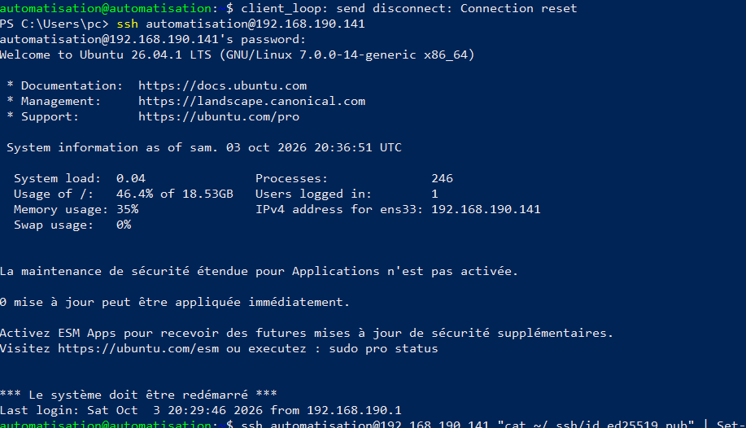

## 3. Installation de Docker

```bash
sudo apt update && sudo apt install -y ca-certificates curl
sudo install -m 0755 -d /etc/apt/keyrings
sudo curl -fsSL https://download.docker.com/linux/ubuntu/gpg -o /etc/apt/keyrings/docker.asc
echo "deb [arch=$(dpkg --print-architecture) signed-by=/etc/apt/keyrings/docker.asc] https://download.docker.com/linux/ubuntu $(. /etc/os-release && echo $VERSION_CODENAME) stable" | sudo tee /etc/apt/sources.list.d/docker.list
sudo apt update
sudo apt install -y docker-ce docker-ce-cli containerd.io docker-buildx-plugin docker-compose-plugin
sudo usermod -aG docker $USER && newgrp docker
docker --version
docker run hello-world
```


## 4. Installation de Jenkins (service)

```bash
sudo apt install -y fontconfig openjdk-21-jre
sudo wget -O /etc/apt/keyrings/jenkins-keyring.asc https://pkg.jenkins.io/debian-stable/jenkins.io-2026.key
echo "deb [signed-by=/etc/apt/keyrings/jenkins-keyring.asc] https://pkg.jenkins.io/debian-stable binary/" | sudo tee /etc/apt/sources.list.d/jenkins.list
sudo apt update && sudo apt install -y jenkins
sudo systemctl enable --now jenkins
systemctl status jenkins --no-pager
sudo ufw allow 8080/tcp
sudo cat /var/lib/jenkins/secrets/initialAdminPassword
```

Vérification depuis la machine physique : `http://192.168.190.141:8080`

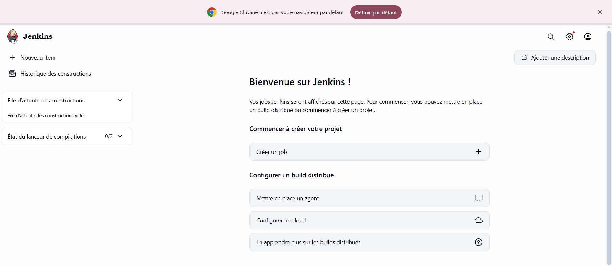

## 5. Mini CV One Page (HTML5 / CSS3 / JavaScript) géré avec Git

```bash
mkdir ~/mini-cv && cd ~/mini-cv
git init -b main
git add .
git commit -m "Ajout du mini CV one page (HTML/CSS/JS)"
```

Lien GitHub : https://github.com/soulaymahableni/mini-cv

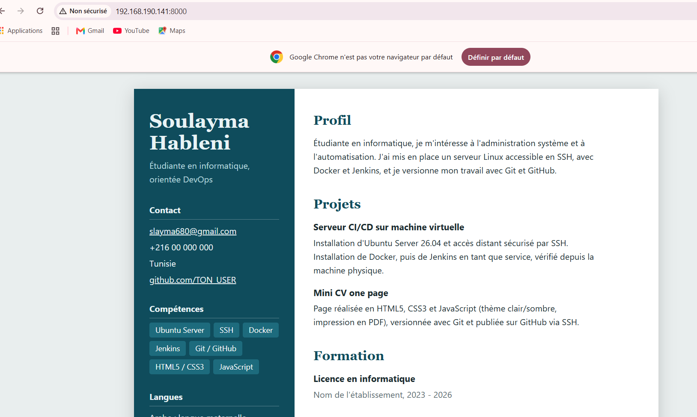

## 6. Push GitHub via SSH

```bash
ssh-keygen -t ed25519 -C "votre@email.com"
cat ~/.ssh/id_ed25519.pub
# GitHub > Settings > SSH and GPG keys > New SSH key > coller la clé publique > Add SSH key
ssh -T git@github.com
git remote add origin git@github.com:soulaymahableni/mini-cv.git
git remote -v
git push -u origin main
```

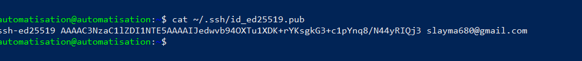
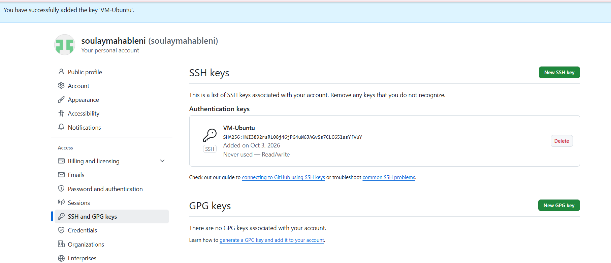
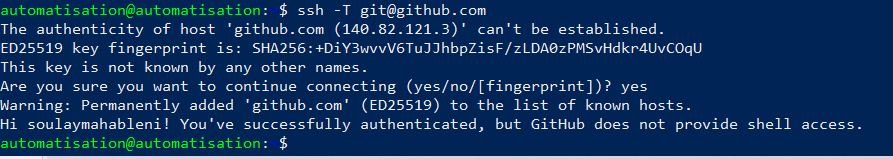
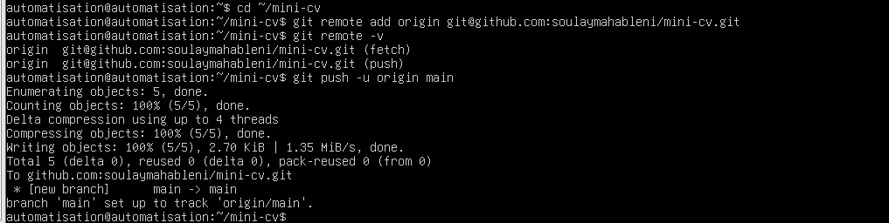

---

## 7. Évolution vers un DevSecOps Portfolio

Sections : **About, Skills, Projects, Experience, Contact**.

Principales améliorations :
- barre de navigation fixe avec liens vers chaque section ;
- bandeau d'accueil avec un pipeline animé (Commit → Build → Scan → Deploy) ;
- mise en page responsive (grille CSS) et thème clair/sombre automatique ;
- accessibilité : focus visible, respect de `prefers-reduced-motion` ;
- contenu des projets piloté par JavaScript (voir étape 9).

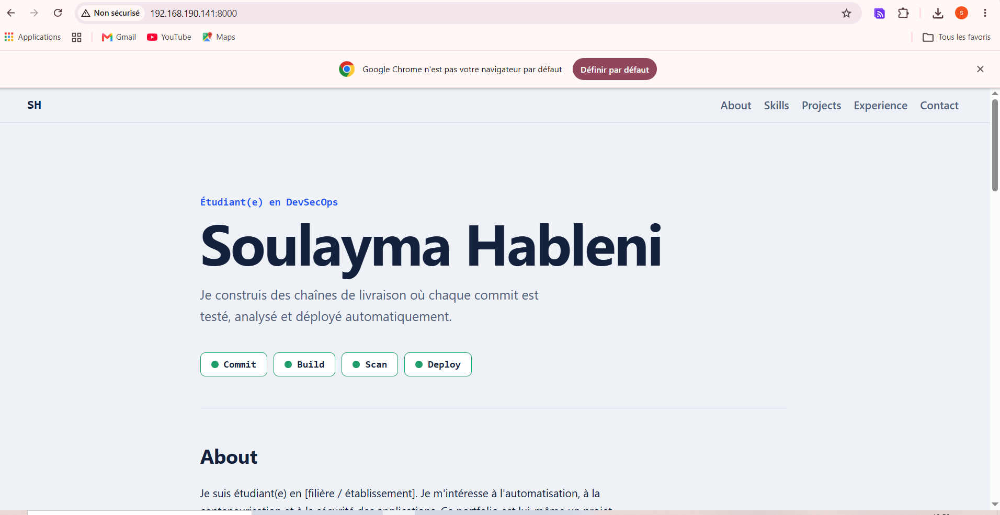

## 8. Section DevSecOps Skills

Git, Docker, Jenkins, Kubernetes, Ansible, Terraform, Argo CD : une carte par outil, avec son usage dans le projet.

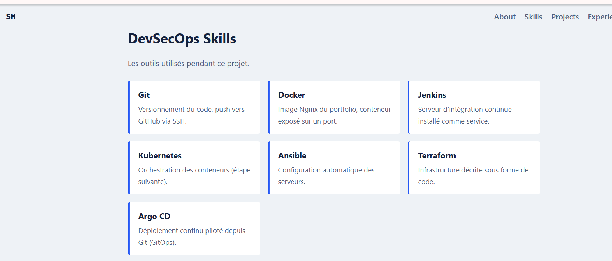

## 9. Section Projects dynamique (JavaScript)

```js
const projects = [
  { title: "Portfolio DevSecOps", description: "Site statique servi par Nginx dans un conteneur Docker.",
    tags: ["Docker", "Git"], link: "https://github.com/soulaymahableni/mini-cv" },
  { title: "Pipeline Jenkins", description: "Build et test automatiques à chaque push GitHub.",
    tags: ["Jenkins", "Git"], link: "#" },
  // ...
];

projects.forEach(p => {
  const card = document.createElement("article");
  card.className = "project";
  card.innerHTML = `<h3>${p.title}</h3><p>${p.description}</p>`;
  list.appendChild(card);
});
```

Les cartes et les boutons de filtre sont générés à partir du tableau `projects`.

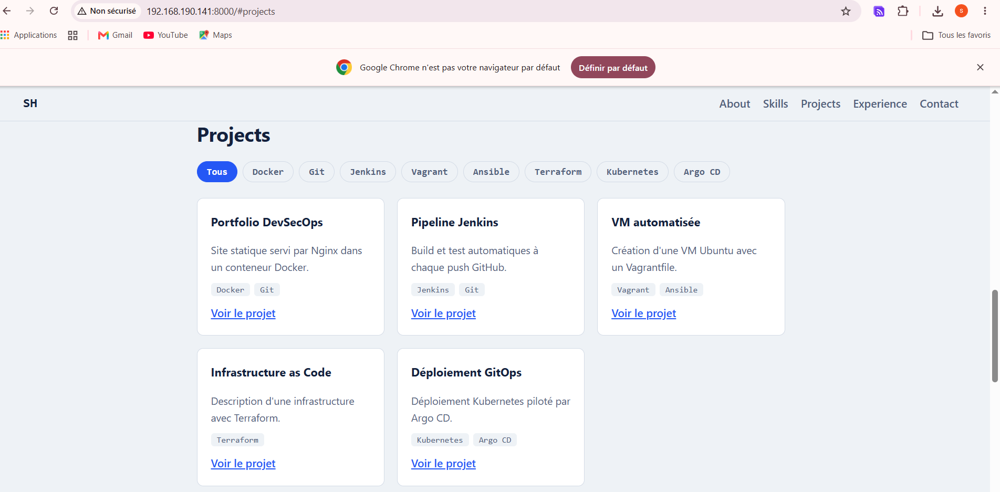

---

## 10. Dockerfile

```dockerfile
FROM nginx:alpine
COPY index.html style.css script.js /usr/share/nginx/html/
EXPOSE 80
```

- `FROM nginx:alpine` : image Nginx légère (basée sur Alpine) ;
- `COPY` : place les fichiers du portfolio dans le dossier servi par Nginx ;
- `EXPOSE 80` : documente le port d'écoute du conteneur.

## 11. Construction de l'image `cv-docker`

```bash
docker build -t cv-docker .
docker images | grep cv-docker
```

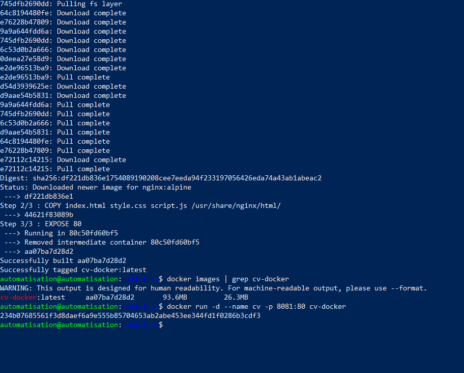

## 12. Exécution du conteneur

Le port 8080 étant utilisé par Jenkins, le portfolio est exposé sur le port **8081**.

```bash
docker run -d --name cv -p 8081:80 cv-docker
docker ps
```

Accès depuis la machine physique : `http://192.168.190.141:8081`

> **Problème rencontré :** le site était inaccessible depuis la machine physique (timeout), alors que le conteneur tournait. Cause : le pare-feu UFW bloquait le port et le trafic du réseau Docker. Solution :
> ```bash
> sudo ufw allow 8081/tcp
> sudo ufw allow in on docker0
> sudo ufw route allow in on docker0
> sudo ufw route allow out on docker0
> ```

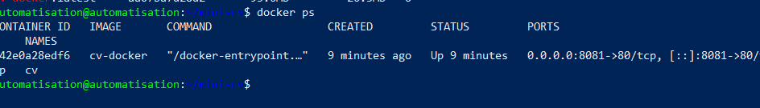
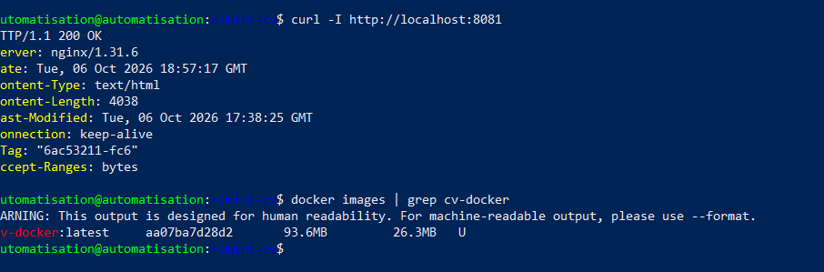


## 13. Déploiement avec Docker Compose

`docker-compose.yml` :

```yaml
services:
  portfolio:
    image: cv-docker
    build: .
    container_name: portfolio
    ports:
      - "8081:80"
    restart: unless-stopped
```

```bash
docker rm -f cv
docker compose up -d
docker compose ps
```

Résultat :

```
NAME        IMAGE       COMMAND                  SERVICE     STATUS         PORTS
portfolio   cv-docker   "/docker-entrypoint.…"   portfolio   Up 6 minutes   0.0.0.0:8081->80/tcp, [::]:8081->80/tcp
```

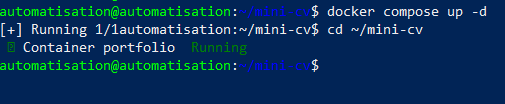


## 14. Publication sur GitHub via SSH

```bash
git add .
git commit -m "Add DevSecOps portfolio, Dockerfile and Compose"
git push origin main
```

Dépôt mis à jour : https://github.com/soulaymahableni/mini-cv

---

## 15. Vagrant : création automatique d'une VM Ubuntu

**Vérification des ressources de la VM :**

```bash
free -h        # RAM : 3,3 Go
df -h /        # disque : extension du LVM de 19 Go à 38 Go
nproc          # 4 CPU
egrep -c '(vmx|svm)' /proc/cpuinfo   # > 0 : virtualisation imbriquée activée
```

Pour activer la virtualisation imbriquée, il a fallu désactiver Hyper-V côté Windows (`bcdedit /set hypervisorlaunchtype off`), puis cocher *Virtualize Intel VT-x/EPT* dans les paramètres processeur de la VM VMware.

L'espace disque a été étendu :

```bash
sudo lvextend -r -l +100%FREE /dev/mapper/ubuntu--vg-ubuntu--lv
```

**Installation :**

```bash
wget -O - https://apt.releases.hashicorp.com/gpg | sudo gpg --dearmor -o /usr/share/keyrings/hashicorp-archive-keyring.gpg
echo "deb [signed-by=/usr/share/keyrings/hashicorp-archive-keyring.gpg] https://apt.releases.hashicorp.com $(. /etc/os-release && echo $VERSION_CODENAME) main" | sudo tee /etc/apt/sources.list.d/hashicorp.list
sudo apt update && sudo apt install -y vagrant virtualbox
sudo mkdir -p /etc/vbox && echo "* 192.168.56.0/21" | sudo tee /etc/vbox/networks.conf
```

**Vagrantfile :**

```ruby
Vagrant.configure("2") do |config|
  config.vm.box = "bento/ubuntu-24.04"
  config.vm.hostname = "ubuntu-vagrant"

  config.vm.provider "virtualbox" do |vb|
    vb.name   = "ubuntu-vagrant"
    vb.memory = 1024
    vb.cpus   = 1
    vb.customize ["modifyvm", :id, "--paravirtprovider", "kvm"]
  end
end
```

> Une box Ubuntu 24.04 (LTS) est utilisée car une box 26.04 n'est pas forcément disponible.

**Création de la VM :**

```bash
cd ~/vagrant-lab
vagrant up
vagrant status
```

> **Problème rencontré :** avec un provisioning `apt-get update`, la connexion SSH de la VM imbriquée était coupée (« The SSH connection was unexpectedly closed »), puis la VM passait en état `paused` ou `aborted` (mémoire limitée de la VM hôte). Solutions : libérer la mémoire (arrêt de Docker Compose et de Jenkins), supprimer le provisioning, utiliser `--paravirtprovider kvm`, puis `vagrant destroy -f && vagrant up`.

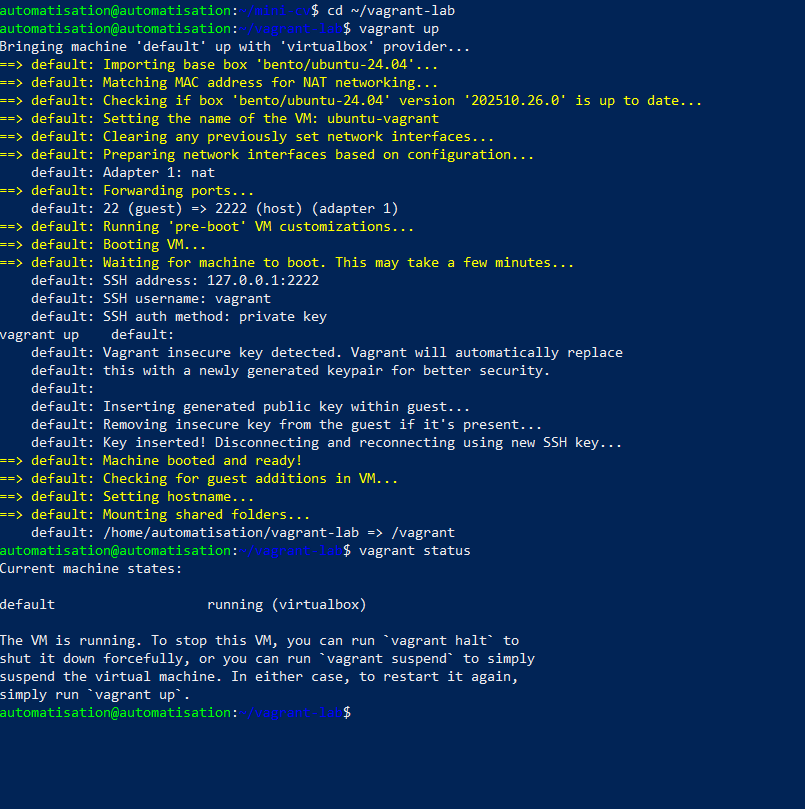

## 16. Connexion avec `vagrant ssh` et comparaison

```bash
cd ~/vagrant-lab
vagrant ssh
hostname
cat /etc/os-release | head -3
exit
```

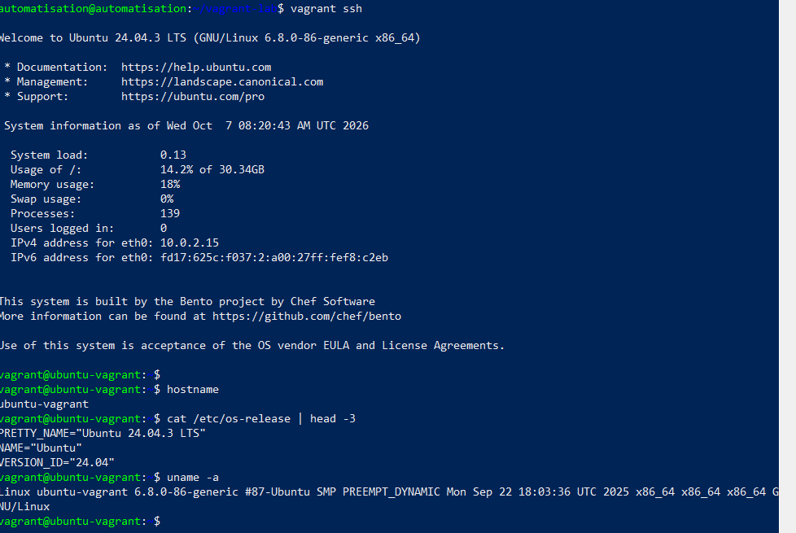

### Comparaison avec la création manuelle de la VM

| Critère | Création manuelle (VMware + ISO) | Vagrant |
|---|---|---|
| Temps | long : ISO, installation, réglages | quelques minutes, une commande |
| Reproductibilité | faible, dépend des choix faits à la main | identique à chaque `vagrant up` |
| Versionnement | aucun | le `Vagrantfile` est versionné avec Git |
| Configuration | manuelle | automatisée par le provisioning |
| Accès SSH | à installer et configurer | `vagrant ssh`, clés gérées automatiquement |
| Ressources | réglées dans l'interface | décrites dans le code (RAM, CPU, réseau) |
| Suppression / recréation | longue | `vagrant destroy` puis `vagrant up` |

Vagrant apporte la logique « infrastructure as code » : l'environnement est décrit dans un fichier, partageable et reproductible. La création manuelle reste utile pour apprendre l'installation complète d'un système.

## 17. Configuration automatique de la VM avec le Vagrantfile

Le Vagrantfile définit automatiquement le nom de la VM, son adresse IP privée, sa mémoire et son nombre de CPU, à partir de variables placées en tête de fichier.

```ruby
VM_NAME   = "ubuntu-vagrant"
VM_IP     = "192.168.56.20"
VM_MEMORY = 1024
VM_CPUS   = 1

Vagrant.configure("2") do |config|
  config.vm.box = "bento/ubuntu-24.04"
  config.vm.hostname = VM_NAME
  config.vm.network "private_network", ip: VM_IP

  config.vm.provider "virtualbox" do |vb|
    vb.name   = VM_NAME
    vb.memory = VM_MEMORY
    vb.cpus   = VM_CPUS
    vb.customize ["modifyvm", :id, "--paravirtprovider", "kvm"]
  end
end
```

| Paramètre | Valeur |
|---|---|
| Nom de la VM | ubuntu-vagrant |
| Adresse IP privée | 192.168.56.20 |
| Mémoire | 1024 Mo |
| CPU | 1 |


Résultat de `vagrant status` :

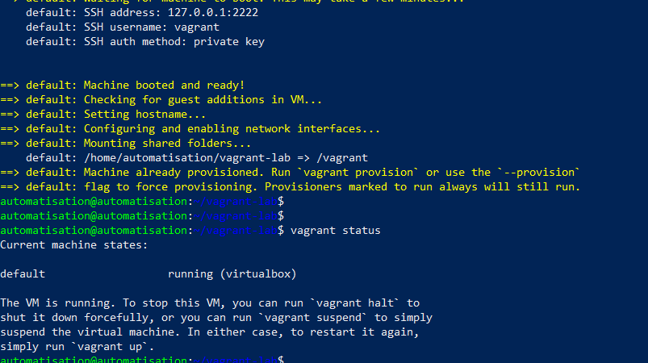

Vérification dans la VM (hostname, IP, mémoire, CPU) :

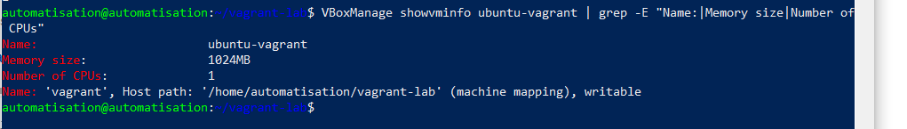
